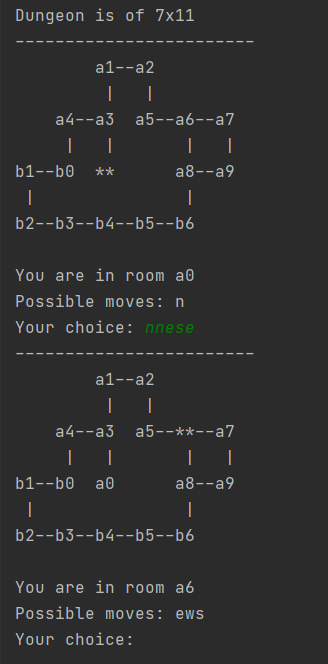

# Dungeon-Crawling Console Game

### Some features:
- Dungeon map is defined in input file.
- Each line specifies room name and connections to other rooms: `a3 n:a1 s:a0 w:a4`
- a0 to b6 are room names (they can be any 2-character names for simplicity)
- n, s, e, w are doors leading to next rooms located north, south, east or west from current room.
- It also allows entering multiple directions at a time: 'nnese' means you are making list of moves n, n, e, s, e

